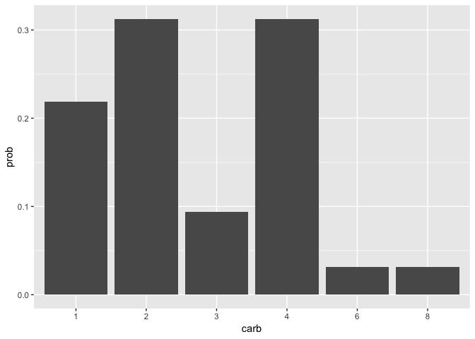

## Probability Distribution
What is the probability that I will pick a car with 4 carburetors, `mtcars$carb`?
$$P = $$

```r
prob <- table(mtcars$carb) / nrow(mtcars)
prob
```

```
## 
##       1       2       3       4       6       8 
## 0.21875 0.31250 0.09375 0.31250 0.03125 0.03125
```

Instead of making a bar chart of the frequencies, we can make a bar chart of the
probabilities. This is called a **probability mass function (PMF)**.

```r
prob_tbl <- as.data.frame(prob) %>%
  rename(carb = Var1, prob = Freq)

# Probability Mass Function (PMF)
ggplot(prob_tbl, aes(x = carb, y = prob)) + 
  geom_histogram(stat = "identity")
```

```
## Warning: Ignoring unknown parameters: binwidth, bins, pad
```

<!-- -->

PMF depends on the number of bins for descrete variables to make sense. For continuous variable, **probability density function (PDF)** is used.
