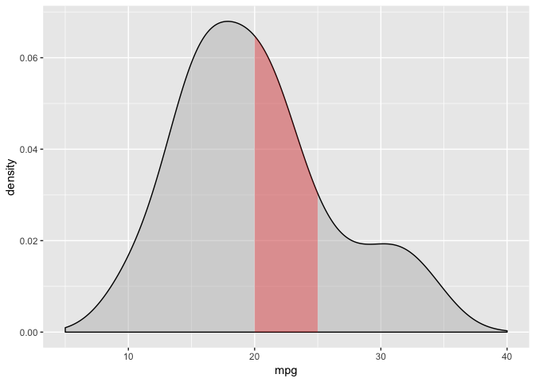
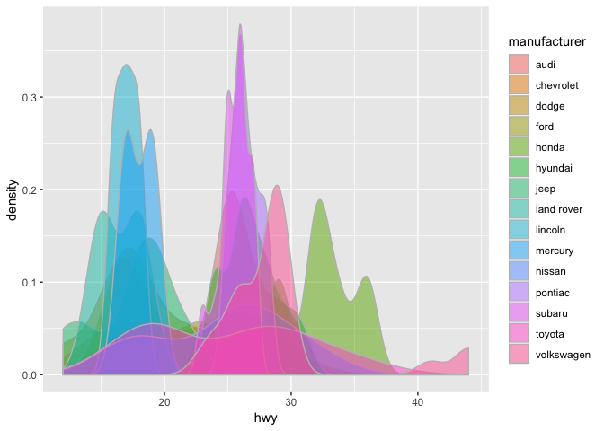

## Probability Density Function (PDF)
$$\int_{a}^{b}f(x)dx$$
For any given point, i.e. probabily of x = 1.13 is 0 because in x, a continuous random can have infintely small lntervals. Thus, we define probabilty for a continuous random variable by giving it a range.
Example, what is the probability of mpg, x between (20 < x < 25) 

```r
# what is the probability of mpg, x between (20 < x < 25) 
mpg_density <- density(mtcars$mpg)
pdf <- approxfun(mpg_density$x, mpg_density$y)
integrate(pdf, 10, 25) # 0.25 or 25%
```

```
## 0.7591429 with absolute error < 4.4e-05
```

```r
# plotting areas under curve
library(ggplot2)
ggplot(mtcars, aes(x = mpg),  xlim = c(0, 50)) + 
  geom_density(fill = "grey", 
               alpha = 0.5) +
  stat_function(fun = pdf, 
                xlim = c(20, 25), # shade auc
                geom = "area",
                fill = "red",
                alpha = 0.3) + # set transparency
  xlim(c(5, 40))
```

<!-- -->

## Relationship Between Variables
### Visualising relationship 2 categorical / continuous variables

```r
ggplot(mpg, aes(x = hwy, 
                fill = manufacturer)) +
  geom_density(colour = "grey",
               alpha = 0.5)
```

<!-- -->

