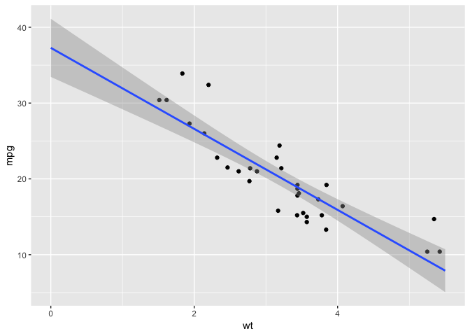

```r
library(tidyverse)
library(ggvis)
```


```r
y = lm(mpg ~ wt, mtcars) # deriving a linear regression
summary(y)
```

```
## 
## Call:
## lm(formula = mpg ~ wt, data = mtcars)
## 
## Residuals:
##     Min      1Q  Median      3Q     Max 
## -4.5432 -2.3647 -0.1252  1.4096  6.8727 
## 
## Coefficients:
##             Estimate Std. Error t value Pr(>|t|)    
## (Intercept)  37.2851     1.8776  19.858  < 2e-16 ***
## wt           -5.3445     0.5591  -9.559 1.29e-10 ***
## ---
## Signif. codes:  0 '***' 0.001 '**' 0.01 '*' 0.05 '.' 0.1 ' ' 1
## 
## Residual standard error: 3.046 on 30 degrees of freedom
## Multiple R-squared:  0.7528,	Adjusted R-squared:  0.7446 
## F-statistic: 91.38 on 1 and 30 DF,  p-value: 1.294e-10
```

```r
# plot a linear regression using ggvis
mtcars %>%
  ggvis(~wt, ~mpg) %>%
  layer_points() %>%
  layer_model_predictions(model = "lm", se = TRUE)
```

```
## Guessing formula = mpg ~ wt
```

<!--html_preserve--><div id="plot_id772902501-container" class="ggvis-output-container">
<div id="plot_id772902501" class="ggvis-output"></div>
<div class="plot-gear-icon">
<nav class="ggvis-control">
<a class="ggvis-dropdown-toggle" title="Controls" onclick="return false;"></a>
<ul class="ggvis-dropdown">
<li>
Renderer: 
<a id="plot_id772902501_renderer_svg" class="ggvis-renderer-button" onclick="return false;" data-plot-id="plot_id772902501" data-renderer="svg">SVG</a>
 | 
<a id="plot_id772902501_renderer_canvas" class="ggvis-renderer-button" onclick="return false;" data-plot-id="plot_id772902501" data-renderer="canvas">Canvas</a>
</li>
<li>
<a id="plot_id772902501_download" class="ggvis-download" data-plot-id="plot_id772902501">Download</a>
</li>
</ul>
</nav>
</div>
</div>
<script type="text/javascript">
var plot_id772902501_spec = {
  "data": [
    {
      "name": ".0",
      "format": {
        "type": "csv",
        "parse": {
          "wt": "number",
          "mpg": "number"
        }
      },
      "values": "\"wt\",\"mpg\"\n2.62,21\n2.875,21\n2.32,22.8\n3.215,21.4\n3.44,18.7\n3.46,18.1\n3.57,14.3\n3.19,24.4\n3.15,22.8\n3.44,19.2\n3.44,17.8\n4.07,16.4\n3.73,17.3\n3.78,15.2\n5.25,10.4\n5.424,10.4\n5.345,14.7\n2.2,32.4\n1.615,30.4\n1.835,33.9\n2.465,21.5\n3.52,15.5\n3.435,15.2\n3.84,13.3\n3.845,19.2\n1.935,27.3\n2.14,26\n1.513,30.4\n3.17,15.8\n2.77,19.7\n3.57,15\n2.78,21.4"
    },
    {
      "name": ".0/model_prediction1",
      "format": {
        "type": "csv",
        "parse": {
          "resp_upr_": "number",
          "pred_": "number",
          "resp_lwr_": "number",
          "resp_": "number"
        }
      },
      "values": "\"resp_upr_\",\"pred_\",\"resp_lwr_\",\"resp_\"\n31.4341217313206,1.513,26.9637596243046,29.1989406778126\n31.1204993874088,1.56250632911392,26.748211630978,28.9343555091934\n30.8072470380303,1.61201265822785,26.532293643118,28.6697703405742\n30.4943905399572,1.66151898734177,26.3159798039527,28.4051851719549\n30.1819579750846,1.7110253164557,26.0992420315869,28.1406000033357\n29.8699798618842,1.76053164556962,25.8820498075489,27.8760148347165\n29.5584893857579,1.81003797468354,25.6643699464367,27.6114296660973\n29.2475226490581,1.85954430379747,25.4461663458981,27.3468444974781\n28.9371189411946,1.90905063291139,25.2273997165231,27.0822593288588\n28.6273210287383,1.95855696202532,25.0080272917409,26.8176741602396\n28.3181754647066,2.00806329113924,24.7880025185342,26.5530889916204\n28.0097329152165,2.05756962025316,24.5672747307859,26.2885038230012\n27.7020485003464,2.10707594936709,24.3457888084175,26.023918654382\n27.3951821442752,2.15658227848101,24.1234848272503,25.7593334857627\n27.0891989274822,2.20608860759494,23.9002977068049,25.4947483171435\n26.7841694309033,2.25559493670886,23.6761568661453,25.2301631485243\n26.4801700583702,2.30510126582278,23.4509859014399,24.9655779799051\n26.1772833193625,2.35460759493671,23.2247023032092,24.7009928112859\n25.8755980490886,2.40411392405063,22.9972172362447,24.4364076426666\n25.5752095372801,2.45362025316456,22.7684354108148,24.1718224740474\n25.276219531088,2.50312658227848,22.5382550797684,23.9072373054282\n24.9787360715631,2.55263291139241,22.3065682020549,23.642652136809\n24.6828731181045,2.60213924050633,22.073260818275,23.3780669681898\n24.3887499120139,2.65164556962025,21.8382136871272,23.1134817995705\n24.096490030255,2.70115189873418,21.6013032316477,22.8488966309513\n23.8062200853351,2.7506582278481,21.3624028393291,22.5843114623321\n23.5180680386105,2.80016455696203,21.1213845488153,22.3197262937129\n23.2321611137817,2.84967088607595,20.8781211364057,22.0551411250937\n22.9486233256676,2.89917721518987,20.6324885872813,21.7905559564744\n22.6675726760022,2.9486835443038,20.3843688997083,21.5259707878552\n22.3891181105935,2.99818987341772,20.1336531278785,21.261385619236\n22.1133563760938,3.04769620253165,19.8802445251398,20.9968004506168\n21.8403689531932,3.09720253164557,19.624061610802,20.7322152819976\n21.5702192684414,3.14670886075949,19.3650409583153,20.4676301133783\n21.3029503917649,3.19621518987342,19.1031394977534,20.2030449447591\n21.0385834062175,3.24572151898734,18.8383361460623,19.9384597761399\n20.7771165901197,3.29522784810127,18.5706326249216,19.6738746075207\n20.5185254843377,3.34473417721519,18.3000533934652,19.4092894389015\n20.2627638386563,3.39424050632911,18.0266447019082,19.1447042702822\n20.0097653533643,3.44374683544304,17.7504728499618,18.880119101663\n19.7594460674074,3.49325316455696,17.4716217986802,18.6155339330438\n19.5117072017912,3.54275949367089,17.190190327058,18.3509487644246\n19.266438250352,3.59226582278481,16.9062889412588,18.0863635958054\n19.023520118358,3.64177215189873,16.6200367360143,17.8217784271861\n18.7828281372767,3.69127848101266,16.3315583798572,17.5571932585669\n18.5442348238948,3.74078481012658,16.0409813560006,17.2926080899477\n18.307612296075,3.79029113924051,15.748433546582,17.0280229213285\n18.0728342993708,3.83979746835443,15.4540412060478,16.7634377527093\n17.8397778342311,3.88930379746835,15.157927333949,16.49885258409\n17.6083244005099,3.93881012658228,14.8602104304317,16.2342674154708\n17.3783608941716,3.9883164556962,14.5610035995316,15.9696822468516\n17.1497802013801,4.03782278481013,14.2604139550846,15.7050970782324\n16.9224815391307,4.08732911392405,13.9585422800956,15.4405119096132\n16.6963705909696,4.13683544303798,13.6554828910183,15.1759267409939\n16.4713594827389,4.1863417721519,13.3513236620105,14.9113415723747\n16.2473666380091,4.23584810126582,13.0461461695019,14.6467564037555\n16.0243165469005,4.28535443037975,12.740025923372,14.3821712351363\n15.8021394760335,4.33486075949367,12.4330326570007,14.1175860665171\n15.5807711417929,4.3843670886076,12.1252306540028,13.8530008978978\n15.3601523641871,4.43387341772152,11.8166790943701,13.5884157292786\n15.1402287143902,4.48337974683544,11.5074324069286,13.3238305606594\n14.9209501655981,4.53288607594937,11.1975406184823,13.0592453920402\n14.7022707540356,4.58239240506329,10.8870496928064,12.794660223421\n14.4841482547477,4.63189873417722,10.5760018548558,12.5300750548017\n14.266543875108,4.68140506329114,10.2644358972571,12.2654898861825\n14.0494219676868,4.73091139240506,9.95238746743981,12.0009047175633\n13.8327497631713,4.78041772151899,9.6398893347169,11.7363195489441\n13.6164971233358,4.82992405063291,9.32697163731397,11.4717343803249\n13.400636313583,4.87943037974684,9.01366210982825,11.2071492117056\n13.185141794249,4.92893670886076,8.69998629192387,10.9425640430864\n12.96999002966,4.97844303797468,8.38596771927446,10.6779788744672\n12.7551593138153,5.02794936708861,8.07162809788066,10.413393705848\n12.5406296115153,5.07745569620253,7.75698746294225,10.1488085372288\n12.3263824137488,5.12696202531646,7.44206432347029,9.88422336860955\n12.1124006061819,5.17646835443038,7.1268757937988,9.61963819999033\n11.8986683496337,5.2259746835443,6.81143771310854,9.35505303137111\n11.685170971489,5.27548101265823,6.49576475401476,9.09046786275189\n11.4718948670624,5.32498734177215,6.17987052120298,8.82588269413267\n11.2588274100015,5.37449367088608,5.86376764102542,8.56129752551345\n11.0459568708893,5.424,5.5474678428992,8.29671235689423"
    },
    {
      "name": "scale/x",
      "format": {
        "type": "csv",
        "parse": {
          "domain": "number"
        }
      },
      "values": "\"domain\"\n1.31745\n5.61955"
    },
    {
      "name": "scale/y",
      "format": {
        "type": "csv",
        "parse": {
          "domain": "number"
        }
      },
      "values": "\"domain\"\n4.12984123504415\n35.317626607855"
    }
  ],
  "scales": [
    {
      "name": "x",
      "domain": {
        "data": "scale/x",
        "field": "data.domain"
      },
      "zero": false,
      "nice": false,
      "clamp": false,
      "range": "width"
    },
    {
      "name": "y",
      "domain": {
        "data": "scale/y",
        "field": "data.domain"
      },
      "zero": false,
      "nice": false,
      "clamp": false,
      "range": "height"
    }
  ],
  "marks": [
    {
      "type": "symbol",
      "properties": {
        "update": {
          "fill": {
            "value": "#000000"
          },
          "size": {
            "value": 50
          },
          "x": {
            "scale": "x",
            "field": "data.wt"
          },
          "y": {
            "scale": "y",
            "field": "data.mpg"
          }
        },
        "ggvis": {
          "data": {
            "value": ".0"
          }
        }
      },
      "from": {
        "data": ".0"
      }
    },
    {
      "type": "area",
      "properties": {
        "update": {
          "fill": {
            "value": "#333333"
          },
          "y2": {
            "scale": "y",
            "field": "data.resp_upr_"
          },
          "fillOpacity": {
            "value": 0.2
          },
          "x": {
            "scale": "x",
            "field": "data.pred_"
          },
          "y": {
            "scale": "y",
            "field": "data.resp_lwr_"
          },
          "stroke": {
            "value": "transparent"
          }
        },
        "ggvis": {
          "data": {
            "value": ".0/model_prediction1"
          }
        }
      },
      "from": {
        "data": ".0/model_prediction1"
      }
    },
    {
      "type": "line",
      "properties": {
        "update": {
          "stroke": {
            "value": "#000000"
          },
          "strokeWidth": {
            "value": 2
          },
          "x": {
            "scale": "x",
            "field": "data.pred_"
          },
          "y": {
            "scale": "y",
            "field": "data.resp_"
          },
          "fill": {
            "value": "transparent"
          }
        },
        "ggvis": {
          "data": {
            "value": ".0/model_prediction1"
          }
        }
      },
      "from": {
        "data": ".0/model_prediction1"
      }
    }
  ],
  "legends": [],
  "axes": [
    {
      "type": "x",
      "scale": "x",
      "orient": "bottom",
      "layer": "back",
      "grid": true,
      "title": "wt"
    },
    {
      "type": "y",
      "scale": "y",
      "orient": "left",
      "layer": "back",
      "grid": true,
      "title": "mpg"
    }
  ],
  "padding": null,
  "ggvis_opts": {
    "keep_aspect": false,
    "resizable": true,
    "padding": {},
    "duration": 250,
    "renderer": "svg",
    "hover_duration": 0,
    "width": 672,
    "height": 480
  },
  "handlers": null
};
ggvis.getPlot("plot_id772902501").parseSpec(plot_id772902501_spec);
</script><!--/html_preserve-->

```r
# Alternative render with ggplot
mtcars %>%
  ggplot(aes(x = wt, y = mpg)) +
  geom_point() +
  geom_smooth(method = "lm", fullrange = TRUE) +
  xlim(0, 5.5)
```

<!-- -->

