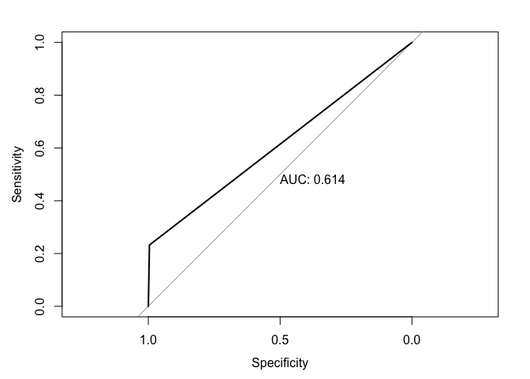

## GLM: Logistic Regression


```r
library(tidyverse)
library(ggvis)
library(grid)
library(gridExtra)
library(pROC)
data("Default", package = "ISLR")
```


```r
default <- Default %>%
  mutate(default = as.numeric(ifelse(
    default == "No", 0, 1)))
  
default <- default %>%
  mutate(student = ifelse(
    student == "No", 0, 1))
```


```r
ggvis(x = ~balance, fill = ~default, default) %>%
  group_by(default) %>%
  layer_densities(stroke := "white")
```

<!--html_preserve--><div id="plot_id901650559-container" class="ggvis-output-container">
<div id="plot_id901650559" class="ggvis-output"></div>
<div class="plot-gear-icon">
<nav class="ggvis-control">
<a class="ggvis-dropdown-toggle" title="Controls" onclick="return false;"></a>
<ul class="ggvis-dropdown">
<li>
Renderer: 
<a id="plot_id901650559_renderer_svg" class="ggvis-renderer-button" onclick="return false;" data-plot-id="plot_id901650559" data-renderer="svg">SVG</a>
 | 
<a id="plot_id901650559_renderer_canvas" class="ggvis-renderer-button" onclick="return false;" data-plot-id="plot_id901650559" data-renderer="canvas">Canvas</a>
</li>
<li>
<a id="plot_id901650559_download" class="ggvis-download" data-plot-id="plot_id901650559">Download</a>
</li>
</ul>
</nav>
</div>
</div>
<script type="text/javascript">
var plot_id901650559_spec = {
  "data": [
    {
      "name": "default0/group_by1/density2_flat",
      "format": {
        "type": "csv",
        "parse": {
          "default": "number",
          "pred_": "number",
          "resp_": "number"
        }
      },
      "values": "\"default\",\"pred_\",\"resp_\"\n0,-196.663422677394,3.94625680552177e-06\n0,-185.744463521599,6.40481205314387e-06\n0,-174.825504365804,1.01391918093585e-05\n0,-163.906545210009,1.57028511838307e-05\n0,-152.987586054214,2.35419977790049e-05\n0,-142.068626898419,3.4327790351008e-05\n0,-131.149667742624,4.89899278948764e-05\n0,-120.23070858683,6.78297623943459e-05\n0,-109.311749431035,9.13045261243877e-05\n0,-98.3927902752399,0.000120167120459698\n0,-87.473831119445,0.00015374929180182\n0,-76.5548719636502,0.000191548164931918\n0,-65.6359128078553,0.000232848723013184\n0,-54.7169536520605,0.000275827583889504\n0,-43.7979944962656,0.000318764687739625\n0,-32.8790353404708,0.000359497052031061\n0,-21.9600761846759,0.000395908297781831\n0,-11.041117028881,0.000426467384275093\n0,-0.122157873086195,0.000449460801037732\n0,10.7968012827087,0.00046401750734515\n0,21.7157604385035,0.000470559362881545\n0,32.6347195942984,0.000469382880654203\n0,43.5536787500932,0.000461439019248006\n0,54.4726379058881,0.000448805927637448\n0,65.3915970616829,0.000433068484681337\n0,76.3105562174778,0.000415973871366042\n0,87.2295153732726,0.00039926199077674\n0,98.1484745290675,0.000384092751809195\n0,109.067433684862,0.000371676351941272\n0,119.986392840657,0.000362341128133089\n0,130.905351996452,0.000356248256472147\n0,141.824311152247,0.000353624895371146\n0,152.743270308042,0.000354059416346291\n0,163.662229463837,0.000357147304448314\n0,174.581188619632,0.000362667798620629\n0,185.500147775426,0.000370192406837436\n0,196.419106931221,0.00037929129264386\n0,207.338066087016,0.000389724013778279\n0,218.257025242811,0.000401227998676131\n0,229.175984398606,0.00041348731727451\n0,240.094943554401,0.000426300816899981\n0,251.013902710196,0.000439460366646285\n0,261.93286186599,0.000452720704398197\n0,272.851821021785,0.000465897153753924\n0,283.77078017758,0.000478761890808647\n0,294.689739333375,0.000491173589066483\n0,305.60869848917,0.000503014303399382\n0,316.527657644965,0.000514132644652533\n0,327.44661680076,0.00052452738211546\n0,338.365575956554,0.000534220462877583\n0,349.284535112349,0.000543210863186233\n0,360.203494268144,0.000551600080172402\n0,371.122453423939,0.0005595105638793\n0,382.041412579734,0.000567029847707352\n0,392.960371735529,0.000574272866675905\n0,403.879330891323,0.000581356827654509\n0,414.798290047118,0.000588364980558095\n0,425.717249202913,0.000595383205741413\n0,436.636208358708,0.000602480557874848\n0,447.555167514503,0.000609714403492225\n0,458.474126670298,0.000617164958333381\n0,469.393085826093,0.000624863937697811\n0,480.312044981887,0.000632851333592516\n0,491.231004137682,0.000641191808704408\n0,502.149963293477,0.000649874904987114\n0,513.068922449272,0.000658885767931532\n0,523.987881605067,0.000668208843026142\n0,534.906840760862,0.000677755716378869\n0,545.825799916657,0.000687419750678179\n0,556.744759072451,0.000697076225737209\n0,567.663718228246,0.00070656322878623\n0,578.582677384041,0.00071574587757925\n0,589.501636539836,0.000724481848744433\n0,600.420595695631,0.000732628826028987\n0,611.339554851426,0.000740167450814026\n0,622.258514007221,0.000747074985311377\n0,633.177473163016,0.000753331549087585\n0,644.09643231881,0.000759077154743087\n0,655.015391474605,0.000764407762215813\n0,665.9343506304,0.000769413138323174\n0,676.853309786195,0.000774236061812627\n0,687.77226894199,0.000778955343073652\n0,698.691228097785,0.000783613498698975\n0,709.61018725358,0.000788213533792851\n0,720.529146409374,0.000792714657461118\n0,731.448105565169,0.000797027357896253\n0,742.367064720964,0.000801035932011932\n0,753.286023876759,0.000804645105428678\n0,764.204983032554,0.000807733742685379\n0,775.123942188349,0.000810191005899448\n0,786.042901344144,0.000812013616856472\n0,796.961860499938,0.000813180399667496\n0,807.880819655733,0.000813673615763243\n0,818.799778811528,0.000813614461257486\n0,829.718737967323,0.000813076142386905\n0,840.637697123118,0.000812106246363926\n0,851.556656278913,0.000810830860601232\n0,862.475615434708,0.00080930811953857\n0,873.394574590503,0.000807558550245279\n0,884.313533746297,0.000805606700263168\n0,895.232492902092,0.000803443592352014\n0,906.151452057887,0.000801020521812689\n0,917.070411213682,0.000798294797297777\n0,927.989370369477,0.000795235363068245\n0,938.908329525271,0.000791783807512796\n0,949.827288681066,0.000787892870633613\n0,960.746247836861,0.000783563590594726\n0,971.665206992656,0.00077876396011153\n0,982.584166148451,0.000773442612964202\n0,993.503125304246,0.00076762261517254\n0,1004.42208446004,0.000761283948451058\n0,1015.34104361584,0.000754351128943502\n0,1026.26000277163,0.000746873961972061\n0,1037.17896192743,0.000738858427497108\n0,1048.09792108322,0.000730285282777034\n0,1059.01688023902,0.000721258030614797\n0,1069.93583939481,0.000711867893070082\n0,1080.8547985506,0.000702209963277356\n0,1091.7737577064,0.000692436493135455\n0,1102.69271686219,0.000682678702947876\n0,1113.61167601799,0.000673059867971761\n0,1124.53063517378,0.000663681086326654\n0,1135.44959432958,0.000654574861520845\n0,1146.36855348537,0.000645752445032789\n0,1157.28751264117,0.000637176931841801\n0,1168.20647179696,0.000628744417047097\n0,1179.12543095276,0.000620354253574872\n0,1190.04439010855,0.000611871736611607\n0,1200.96334926435,0.000603188606426228\n0,1211.88230842014,0.000594219631717474\n0,1222.80126757594,0.000584862112869088\n0,1233.72022673173,0.000575119040102779\n0,1244.63918588753,0.000564999522002407\n0,1255.55814504332,0.000554507180728379\n0,1266.47710419912,0.000543714755210434\n0,1277.39606335491,0.000532687857454837\n0,1288.31502251071,0.000521472599007702\n0,1299.2339816665,0.000510124723685485\n0,1310.1529408223,0.000498685765677784\n0,1321.07189997809,0.000487174902357783\n0,1331.99085913389,0.000475602544295321\n0,1342.90981828968,0.000463977013876406\n0,1353.82877744548,0.00045229904279205\n0,1364.74773660127,0.000440568530105746\n0,1375.66669575707,0.000428798105351502\n0,1386.58565491286,0.0004169991499098\n0,1397.50461406866,0.000405187371585252\n0,1408.42357322445,0.000393383399154126\n0,1419.34253238025,0.000381604336963513\n0,1430.26149153604,0.000369872454200288\n0,1441.18045069183,0.000358204490671697\n0,1452.09940984763,0.000346617525444636\n0,1463.01836900342,0.000335142225756731\n0,1473.93732815922,0.000323810070499439\n0,1484.85628731501,0.000312651343922304\n0,1495.77524647081,0.00030171836204407\n0,1506.6942056266,0.000291068711188914\n0,1517.6131647824,0.000280728203986779\n0,1528.53212393819,0.000270739367996485\n0,1539.45108309399,0.000261149687621614\n0,1550.37004224978,0.00025192964255189\n0,1561.28900140558,0.000243066791966569\n0,1572.20796056137,0.000234563015100513\n0,1583.12691971717,0.000226337273868385\n0,1594.04587887296,0.000218346207583044\n0,1604.96483802876,0.000210562542526831\n0,1615.88379718455,0.00020293490732301\n0,1626.80275634035,0.000195441847200369\n0,1637.72171549614,0.000188087872568561\n0,1648.64067465194,0.000180879005433914\n0,1659.55963380773,0.000173829004343044\n0,1670.47859296353,0.000166971845199174\n0,1681.39755211932,0.000160336008543236\n0,1692.31651127512,0.000153925962782168\n0,1703.23547043091,0.000147756155054748\n0,1714.15442958671,0.000141831618113815\n0,1725.0733887425,0.000136112895243267\n0,1735.9923478983,0.000130571384735997\n0,1746.91130705409,0.000125173730357164\n0,1757.83026620989,0.000119855732708482\n0,1768.74922536568,0.000114572371202244\n0,1779.66818452148,0.00010927704824336\n0,1790.58714367727,0.000103936294787748\n0,1801.50610283307,9.85351648073236e-05\n0,1812.42506198886,9.30698800071119e-05\n0,1823.34402114466,8.75662547679098e-05\n0,1834.26298030045,8.20620754511093e-05\n0,1845.18193945624,7.66100905241841e-05\n0,1856.10089861204,7.12743381421718e-05\n0,1867.01985776783,6.61048734931941e-05\n0,1877.93881692363,6.11588425612647e-05\n0,1888.85777607942,5.64883869687877e-05\n0,1899.77673523522,5.20975602379083e-05\n0,1910.69569439101,4.7999557861186e-05\n0,1921.61465354681,4.42120854251226e-05\n0,1932.5336127026,4.06925868995222e-05\n0,1943.4525718584,3.74230493959947e-05\n0,1954.37153101419,3.44071204892798e-05\n0,1965.29049016999,3.16016221275576e-05\n0,1976.20944932578,2.89930674805034e-05\n0,1987.12840848158,2.65886685038288e-05\n0,1998.04736763737,2.43707932874135e-05\n0,2008.96632679317,2.23313767984438e-05\n0,2019.88528594896,2.0478225641403e-05\n0,2030.80424510476,1.88008713929381e-05\n0,2041.72320426055,1.72816271504535e-05\n0,2052.64216341635,1.59134685328769e-05\n0,2063.56112257214,1.46792649689822e-05\n0,2074.48008172794,1.35495719639499e-05\n0,2085.39904088373,1.250564308427e-05\n0,2096.31800003953,1.15285682523224e-05\n0,2107.23695919532,1.05941632494537e-05\n0,2118.15591835112,9.68961539789567e-06\n0,2129.07487750691,8.80820316119805e-06\n0,2139.99383666271,7.94520503103079e-06\n0,2150.9127958185,7.10355792193418e-06\n0,2161.8317549743,6.29379937715047e-06\n0,2172.75071413009,5.52519612656631e-06\n0,2183.66967328589,4.80817321383733e-06\n0,2194.58863244168,4.15893447679572e-06\n0,2205.50759159747,3.58594392603974e-06\n0,2216.42655075327,3.09274496060886e-06\n0,2227.34550990906,2.68726354341144e-06\n0,2238.26446906486,2.37046042369753e-06\n0,2249.18342822065,2.13420904225569e-06\n0,2260.10238737645,1.97557661421243e-06\n0,2271.02134653224,1.88955068329961e-06\n0,2281.94030568804,1.86081489656309e-06\n0,2292.85926484383,1.87967013173873e-06\n0,2303.77822399963,1.93656963144028e-06\n0,2314.69718315542,2.01458412025136e-06\n0,2325.61614231122,2.10165800606242e-06\n0,2336.53510146701,2.18389404157507e-06\n0,2347.45406062281,2.24880955819734e-06\n0,2358.3730197786,2.28691123437289e-06\n0,2369.2919789344,2.28713659074418e-06\n0,2380.21093809019,2.24573710943464e-06\n0,2391.12989724599,2.16270172371061e-06\n0,2402.04885640178,2.03759872062065e-06\n0,2412.96781555758,1.87658486897729e-06\n0,2423.88677471337,1.68934075989023e-06\n0,2434.80573386917,1.48437746507098e-06\n0,2445.72469302496,1.27260696689981e-06\n0,2456.64365218076,1.06417822835839e-06\n0,2467.56261133655,8.670561403738e-07\n0,2478.48157049235,6.8948903417323e-07\n0,2489.40052964814,5.33838613780282e-07\n0,2500.31948880394,4.01782224294276e-07\n0,2511.23844795973,2.95813351402492e-07\n0,2522.15740711553,2.11731422797917e-07\n0,2533.07636627132,1.47019547877987e-07\n0,2543.99532542712,9.99638677623495e-08\n0,2554.91428458291,6.61117719399008e-08\n0,2565.83324373871,4.23218582765599e-08\n0,2576.7522028945,2.65162746942435e-08\n0,2587.6711620503,1.62079364197737e-08\n1,364.014590626483,1.71705892823634e-07\n1,374.12710250664,2.36062019722069e-07\n1,384.239614386797,3.21191867083311e-07\n1,394.352126266954,4.32973552752746e-07\n1,404.464638147112,5.76118536060203e-07\n1,414.577150027269,7.612747592693e-07\n1,424.689661907426,9.91208081944915e-07\n1,434.802173787583,1.28362665845903e-06\n1,444.914685667741,1.63766324878687e-06\n1,455.027197547898,2.0765019222862e-06\n1,465.139709428055,2.59820173925506e-06\n1,475.252221308212,3.22413072420268e-06\n1,485.36473318837,3.95593762808487e-06\n1,495.477245068527,4.80713477342181e-06\n1,505.589756948684,5.78362318521614e-06\n1,515.702268828841,6.8862327845609e-06\n1,525.814780708999,8.12440546598218e-06\n1,535.927292589156,9.48320670896995e-06\n1,546.039804469313,1.09728670836111e-05\n1,556.15231634947,1.25639811333465e-05\n1,566.264828229628,1.42599910028151e-05\n1,576.377340109785,1.60256594172069e-05\n1,586.489851989942,1.78472888038518e-05\n1,596.602363870099,1.96925454500259e-05\n1,606.714875750257,2.15342158186202e-05\n1,616.827387630414,2.33398602246605e-05\n1,626.939899510571,2.50803226894688e-05\n1,637.052411390728,2.67195657257261e-05\n1,647.164923270886,2.82400506267175e-05\n1,657.277435151043,2.95997752085808e-05\n1,667.3899470312,3.08047857783891e-05\n1,677.502458911357,3.18077013959813e-05\n1,687.614970791515,3.26379343933448e-05\n1,697.727482671672,3.32684801742968e-05\n1,707.839994551829,3.37319208152614e-05\n1,717.952506431986,3.4032978433177e-05\n1,728.065018312144,3.42078168381691e-05\n1,738.177530192301,3.42896849623903e-05\n1,748.290042072458,3.43233573856477e-05\n1,758.402553952615,3.43581608971926e-05\n1,768.515065832773,3.44565483927167e-05\n1,778.62757771293,3.46637531215623e-05\n1,788.740089593087,3.50712172800702e-05\n1,798.852601473244,3.57039392894559e-05\n1,808.965113353402,3.66675431678877e-05\n1,819.077625233559,3.79775323348155e-05\n1,829.190137113716,3.97232690417797e-05\n1,839.302648993873,4.19260949591665e-05\n1,849.415160874031,4.46341962017349e-05\n1,859.527672754188,4.78832222141122e-05\n1,869.640184634345,5.16645940756135e-05\n1,879.752696514502,5.60327114686631e-05\n1,889.865208394659,6.09177486271123e-05\n1,899.977720274817,6.63924676202889e-05\n1,910.090232154974,7.23424925545384e-05\n1,920.202744035131,7.8825483696255e-05\n1,930.315255915289,8.57317609351291e-05\n1,940.427767795446,9.30731729241037e-05\n1,950.540279675603,0.000100772005596559\n1,960.65279155576,0.000108799863909862\n1,970.765303435917,0.000117104935368342\n1,980.877815316075,0.000125635325810704\n1,990.990327196232,0.000134355660540798\n1,1001.10283907639,0.000143206371474121\n1,1011.21535095655,0.000152157944896924\n1,1021.3278628367,0.000161157531741337\n1,1031.44037471686,0.000170172092352934\n1,1041.55288659702,0.000179166213652033\n1,1051.66539847718,0.000188107108138404\n1,1061.77791035733,0.000196976979949416\n1,1071.89042223749,0.000205757980355107\n1,1082.00293411765,0.000214448835255441\n1,1092.1154459978,0.000223059341124465\n1,1102.22795787796,0.000231610711911875\n1,1112.34046975812,0.000240142097660615\n1,1122.45298163828,0.000248709944265493\n1,1132.56549351843,0.00025736779813952\n1,1142.67800539859,0.000266223084232271\n1,1152.79051727875,0.000275324256798122\n1,1162.90302915891,0.000284806379413484\n1,1173.01554103906,0.000294719359523157\n1,1183.12805291922,0.000305182457034905\n1,1193.24056479938,0.000316251740464076\n1,1203.35307667953,0.000327986077726107\n1,1213.46558855969,0.00034045069852151\n1,1223.57810043985,0.000353613965404812\n1,1233.69061232001,0.000367548982707461\n1,1243.80312420016,0.000382130579811262\n1,1253.91563608032,0.000397434349396647\n1,1264.02814796048,0.000413283739685499\n1,1274.14065984063,0.000429702617478049\n1,1284.25317172079,0.000446549817694857\n1,1294.36568360095,0.000463797961700615\n1,1304.47819548111,0.000481359112591434\n1,1314.59070736126,0.000499190696702572\n1,1324.70321924142,0.000517256464526419\n1,1334.81573112158,0.000535523691021843\n1,1344.92824300174,0.000554001142537853\n1,1355.04075488189,0.000572665320953969\n1,1365.15326676205,0.000591556681413278\n1,1375.26577864221,0.00061064396124989\n1,1385.37829052236,0.000629961036518004\n1,1395.49080240252,0.000649459284019042\n1,1405.60331428268,0.000669120477828063\n1,1415.71582616284,0.000688865771351457\n1,1425.82833804299,0.000708607153455608\n1,1435.94084992315,0.000728213025726777\n1,1446.05336180331,0.000747549119900088\n1,1456.16587368347,0.000766408769330269\n1,1466.27838556362,0.000784677090153174\n1,1476.39089744378,0.000802056043982522\n1,1486.50340932394,0.000818526084561099\n1,1496.61592120409,0.000833742412809506\n1,1506.72843308425,0.00084778187835558\n1,1516.84094496441,0.000860405599574715\n1,1526.95345684457,0.00087171485353897\n1,1537.06596872472,0.000881666506612974\n1,1547.17848060488,0.000890382928390324\n1,1557.29099248504,0.000898022821364528\n1,1567.40350436519,0.000904741685699276\n1,1577.51601624535,0.000910834232817173\n1,1587.62852812551,0.000916513672862591\n1,1597.74104000567,0.000922091377807787\n1,1607.85355188582,0.000927861833809687\n1,1617.96606376598,0.000934044333739064\n1,1628.07857564614,0.00094094723119115\n1,1638.1910875263,0.000948690878252108\n1,1648.30359940645,0.000957479993090966\n1,1658.41611128661,0.000967365712618228\n1,1668.52862316677,0.000978368600466112\n1,1678.64113504692,0.00099048460802408\n1,1688.75364692708,0.00100354093966679\n1,1698.86615880724,0.00101746841520701\n1,1708.9786706874,0.00103196365622817\n1,1719.09118256755,0.00104685994097293\n1,1729.20369444771,0.00106183321165479\n1,1739.31620632787,0.00107659260841693\n1,1749.42871820803,0.00109087299068086\n1,1759.54123008818,0.00110434379849284\n1,1769.65374196834,0.00111676859158164\n1,1779.7662538485,0.00112789843449231\n1,1789.87876572865,0.00113748462865759\n1,1799.99127760881,0.00114545720455587\n1,1810.10378948897,0.00115152294940284\n1,1820.21630136913,0.00115584335464008\n1,1830.32881324928,0.00115806642230528\n1,1840.44132512944,0.00115854174243007\n1,1850.5538370096,0.00115699753458162\n1,1860.66634888976,0.00115378021609193\n1,1870.77886076991,0.00114880432951703\n1,1880.89137265007,0.00114231850440007\n1,1891.00388453023,0.00113440269682279\n1,1901.11639641038,0.00112520750959904\n1,1911.22890829054,0.00111491417234349\n1,1921.3414201707,0.00110358563924705\n1,1931.45393205086,0.00109144196312698\n1,1941.56644393101,0.00107847010340785\n1,1951.67895581117,0.00106487559941853\n1,1961.79146769133,0.00105060368182937\n1,1971.90397957148,0.00103579098074858\n1,1982.01649145164,0.00102038035594803\n1,1992.1290033318,0.00100441843674312\n1,2002.24151521196,0.000987856572343238\n1,2012.35402709211,0.000970670379385441\n1,2022.46653897227,0.000952836959109096\n1,2032.57905085243,0.000934272587598168\n1,2042.69156273259,0.000915008329475039\n1,2052.80407461274,0.000894909989082773\n1,2062.9165864929,0.000874082634851098\n1,2073.02909837306,0.000852368672118838\n1,2083.14161025321,0.000829918966146989\n1,2093.25412213337,0.000806645226930499\n1,2103.36663401353,0.000782671588392303\n1,2113.47914589369,0.000758006416844701\n1,2123.59165777384,0.000732751541771428\n1,2133.704169654,0.00070699561146469\n1,2143.81668153416,0.000680831104650664\n1,2153.92919341432,0.000654393097900137\n1,2164.04170529447,0.000627785044244014\n1,2174.15421717463,0.000601143248453004\n1,2184.26672905479,0.000574606346567701\n1,2194.37924093494,0.00054827478583696\n1,2204.4917528151,0.00052231076465702\n1,2214.60426469526,0.000496785713568892\n1,2224.71677657542,0.000471843424727837\n1,2234.82928845557,0.000447553037232409\n1,2244.94180033573,0.000423999506950233\n1,2255.05431221589,0.000401271937528854\n1,2265.16682409605,0.000379369259392737\n1,2275.2793359762,0.000358416242528977\n1,2285.39184785636,0.00033831418803015\n1,2295.50435973652,0.00031923175254348\n1,2305.61687161667,0.000300999515515223\n1,2315.72938349683,0.000283759958029343\n1,2325.84189537699,0.000267365535318026\n1,2335.95440725715,0.000251883423851815\n1,2346.0669191373,0.000237223913155448\n1,2356.17943101746,0.000223380022321246\n1,2366.29194289762,0.000210318848437778\n1,2376.40445477777,0.000197973206576323\n1,2386.51696665793,0.000186361435985325\n1,2396.62947853809,0.000175369551413968\n1,2406.74199041825,0.00016505915868177\n1,2416.8545022984,0.000155290605124603\n1,2426.96701417856,0.000146131001172549\n1,2437.07952605872,0.000137461121577066\n1,2447.19203793888,0.000129312926304088\n1,2457.30454981903,0.00012161427793801\n1,2467.41706169919,0.000114359384530755\n1,2477.52957357935,0.000107514457941399\n1,2487.6420854595,0.000101044610641126\n1,2497.75459733966,9.49467695390692e-05\n1,2507.86710921982,8.91644752680563e-05\n1,2517.97962109998,8.37187181842772e-05\n1,2528.09213298013,7.85399254407992e-05\n1,2538.20464486029,7.36602449133082e-05\n1,2548.31715674045,6.90148533814803e-05\n1,2558.42966862061,6.46213288041046e-05\n1,2568.54218050076,6.04393625761741e-05\n1,2578.65469238092,5.64682092908565e-05\n1,2588.76720426108,5.26868183658949e-05\n1,2598.87971614123,4.90806585086686e-05\n1,2608.99222802139,4.56439091530583e-05\n1,2619.10473990155,4.23525561032401e-05\n1,2629.21725178171,3.92132817816593e-05\n1,2639.32976366186,3.61962622697432e-05\n1,2649.44227554202,3.33192676638244e-05\n1,2659.55478742218,3.05532360198771e-05\n1,2669.66729930233,2.79138092400583e-05\n1,2679.77981118249,2.53856899742341e-05\n1,2689.89232306265,2.29789164346297e-05\n1,2700.00483494281,2.06901007707913e-05\n1,2710.11734682296,1.8523031643544e-05\n1,2720.22985870312,1.64849466777643e-05\n1,2730.34237058328,1.45710664553964e-05\n1,2740.45488246344,1.27982384022093e-05\n1,2750.56739434359,1.11504433934563e-05\n1,2760.67990622375,9.65300231635094e-06\n1,2770.79241810391,8.28086555169372e-06\n1,2780.90492998406,7.05482156544211e-06\n1,2791.01744186422,5.95333596414704e-06\n1,2801.12995374438,4.98468343000853e-06\n1,2811.24246562454,4.13441986818241e-06\n1,2821.35497750469,3.39843721951421e-06\n1,2831.46748938485,2.76881129791124e-06\n1,2841.58000126501,2.23204070415086e-06\n1,2851.69251314517,1.78555727356274e-06\n1,2861.80502502532,1.4102819326778e-06\n1,2871.91753690548,1.10747728567284e-06\n1,2882.03004878564,8.57159583327922e-07\n1,2892.14256066579,6.59991049508456e-07\n1,2902.25507254595,5.00904412209501e-07\n1,2912.36758442611,3.77580958977975e-07\n1,2922.48009630627,2.81007056981908e-07\n1,2932.59260818642,2.07217916758771e-07\n1,2942.70512006658,1.51244379863807e-07"
    },
    {
      "name": "default0/group_by1/density2",
      "source": "default0/group_by1/density2_flat",
      "transform": [
        {
          "type": "treefacet",
          "keys": [
            "data.default"
          ]
        }
      ]
    },
    {
      "name": "scale/fill",
      "format": {
        "type": "csv",
        "parse": {
          "domain": "number"
        }
      },
      "values": "\"domain\"\n0\n1"
    },
    {
      "name": "scale/x",
      "format": {
        "type": "csv",
        "parse": {
          "domain": "number"
        }
      },
      "values": "\"domain\"\n-353.631849814592\n3099.67354720378"
    },
    {
      "name": "scale/y",
      "format": {
        "type": "csv",
        "parse": {
          "domain": "number"
        }
      },
      "values": "\"domain\"\n-5.79270871215035e-05\n0.00121646882955157"
    }
  ],
  "scales": [
    {
      "name": "fill",
      "domain": {
        "data": "scale/fill",
        "field": "data.domain"
      },
      "zero": false,
      "nice": false,
      "clamp": false,
      "range": ["#132B43", "#56B1F7"]
    },
    {
      "name": "x",
      "domain": {
        "data": "scale/x",
        "field": "data.domain"
      },
      "zero": false,
      "nice": false,
      "clamp": false,
      "range": "width"
    },
    {
      "name": "y",
      "domain": {
        "data": "scale/y",
        "field": "data.domain"
      },
      "zero": false,
      "nice": false,
      "clamp": false,
      "range": "height"
    }
  ],
  "marks": [
    {
      "type": "group",
      "from": {
        "data": "default0/group_by1/density2"
      },
      "marks": [
        {
          "type": "area",
          "properties": {
            "update": {
              "fill": {
                "scale": "fill",
                "field": "data.default"
              },
              "y2": {
                "scale": "y",
                "value": 0
              },
              "fillOpacity": {
                "value": 0.2
              },
              "x": {
                "scale": "x",
                "field": "data.pred_"
              },
              "y": {
                "scale": "y",
                "field": "data.resp_"
              },
              "stroke": {
                "value": "transparent"
              }
            },
            "ggvis": {
              "data": {
                "value": "default0/group_by1/density2"
              }
            }
          }
        }
      ]
    },
    {
      "type": "group",
      "from": {
        "data": "default0/group_by1/density2"
      },
      "marks": [
        {
          "type": "line",
          "properties": {
            "update": {
              "x": {
                "scale": "x",
                "field": "data.pred_"
              },
              "y": {
                "scale": "y",
                "field": "data.resp_"
              },
              "stroke": {
                "value": "white"
              },
              "fill": {
                "value": "transparent"
              }
            },
            "ggvis": {
              "data": {
                "value": "default0/group_by1/density2"
              }
            }
          }
        }
      ]
    }
  ],
  "legends": [
    {
      "orient": "right",
      "fill": "fill",
      "title": "default"
    }
  ],
  "axes": [
    {
      "type": "x",
      "scale": "x",
      "orient": "bottom",
      "layer": "back",
      "grid": true,
      "title": "balance"
    },
    {
      "type": "y",
      "scale": "y",
      "orient": "left",
      "layer": "back",
      "grid": true,
      "title": "density"
    }
  ],
  "padding": null,
  "ggvis_opts": {
    "keep_aspect": false,
    "resizable": true,
    "padding": {},
    "duration": 250,
    "renderer": "svg",
    "hover_duration": 0,
    "width": 672,
    "height": 480
  },
  "handlers": null
};
ggvis.getPlot("plot_id901650559").parseSpec(plot_id901650559_spec);
</script><!--/html_preserve-->

```r
# people that have higer balance tend to default

ggvis(x = ~income, fill = ~default, default) %>%
  group_by(default) %>%
  layer_densities(stroke := "white")
```

<!--html_preserve--><div id="plot_id401659701-container" class="ggvis-output-container">
<div id="plot_id401659701" class="ggvis-output"></div>
<div class="plot-gear-icon">
<nav class="ggvis-control">
<a class="ggvis-dropdown-toggle" title="Controls" onclick="return false;"></a>
<ul class="ggvis-dropdown">
<li>
Renderer: 
<a id="plot_id401659701_renderer_svg" class="ggvis-renderer-button" onclick="return false;" data-plot-id="plot_id401659701" data-renderer="svg">SVG</a>
 | 
<a id="plot_id401659701_renderer_canvas" class="ggvis-renderer-button" onclick="return false;" data-plot-id="plot_id401659701" data-renderer="canvas">Canvas</a>
</li>
<li>
<a id="plot_id401659701_download" class="ggvis-download" data-plot-id="plot_id401659701">Download</a>
</li>
</ul>
</nav>
</div>
</div>
<script type="text/javascript">
var plot_id401659701_spec = {
  "data": [
    {
      "name": "default0/group_by1/density2_flat",
      "format": {
        "type": "csv",
        "parse": {
          "default": "number",
          "pred_": "number",
          "resp_": "number"
        }
      },
      "values": "\"default\",\"pred_\",\"resp_\"\n0,-4965.9276323115,3.42039017881328e-10\n0,-4635.50388137343,5.75246117646463e-10\n0,-4305.08013043537,9.55523616553205e-10\n0,-3974.6563794973,1.5342313037964e-09\n0,-3644.23262855924,2.38588753968506e-09\n0,-3313.80887762117,3.6483169912943e-09\n0,-2983.38512668311,5.42540816898746e-09\n0,-2652.96137574504,7.83969522544787e-09\n0,-2322.53762480698,1.10876712714521e-08\n0,-1992.11387386891,1.53352349334379e-08\n0,-1661.69012293085,2.06821673847333e-08\n0,-1331.26637199278,2.72929393569462e-08\n0,-1000.84262105472,3.53643426357239e-08\n0,-670.418870116653,4.48762949111309e-08\n0,-339.995119178588,5.58915923607422e-08\n0,-9.57136824052304,6.86361420163718e-08\n0,320.852382697542,8.3023245845658e-08\n0,651.276133635608,9.91435346432228e-08\n0,981.699884573673,1.17305448280686e-07\n0,1312.12363551174,1.37727102753929e-07\n0,1642.5473864498,1.6070820612304e-07\n0,1972.97113738787,1.86890100217618e-07\n0,2303.39488832593,2.17125988998836e-07\n0,2633.818639264,2.52021277177571e-07\n0,2964.24239020206,2.92589582802124e-07\n0,3294.66614114013,3.40703156513806e-07\n0,3625.08989207819,3.97116038605467e-07\n0,3955.51364301626,4.63270274057124e-07\n0,4285.93739395432,5.41994745665084e-07\n0,4616.36114489239,6.34669981060989e-07\n0,4946.78489583045,7.43162037749317e-07\n0,5277.20864676852,8.71035000737616e-07\n0,5607.63239770658,1.02142418712341e-06\n0,5938.05614864465,1.19639650458162e-06\n0,6268.47989958272,1.40005635884224e-06\n0,6598.90365052078,1.63849572292654e-06\n0,6929.32740145884,1.91324580181647e-06\n0,7259.75115239691,2.22823074062512e-06\n0,7590.17490333498,2.5924186356751e-06\n0,7920.59865427304,3.0055932661794e-06\n0,8251.0224052111,3.4705253337338e-06\n0,8581.44615614917,3.99362187380733e-06\n0,8911.86990708724,4.57459742484351e-06\n0,9242.2936580253,5.21149866694501e-06\n0,9572.71740896336,5.90550351753849e-06\n0,9903.14115990143,6.65561218402452e-06\n0,10233.5649108395,7.45476841945204e-06\n0,10563.9886617776,8.29942268133527e-06\n0,10894.4124127156,9.1881535265279e-06\n0,11224.8361636537,1.01114842306605e-05\n0,11555.2599145918,1.10643751804542e-05\n0,11885.6836655298,1.20431128353669e-05\n0,12216.1074164679,1.30398769370095e-05\n0,12546.531167406,1.40484502182849e-05\n0,12876.954918344,1.50627802348595e-05\n0,13207.3786692821,1.60752325269573e-05\n0,13537.8024202201,1.70788398569812e-05\n0,13868.2261711582,1.80662485583639e-05\n0,14198.6499220963,1.90279613589306e-05\n0,14529.0736730343,1.99586362921669e-05\n0,14859.4974239724,2.08519178645202e-05\n0,15189.9211749105,2.16966481831948e-05\n0,15520.3449258485,2.24905057936513e-05\n0,15850.7686767866,2.3228622980558e-05\n0,16181.1924277247,2.39012056087368e-05\n0,16511.6161786627,2.45038890826131e-05\n0,16842.0399296008,2.50338417752319e-05\n0,17172.4636805389,2.54825189274662e-05\n0,17502.8874314769,2.58407849075055e-05\n0,17833.311182415,2.61094887864364e-05\n0,18163.7349333531,2.62841564283399e-05\n0,18494.1586842911,2.63526614427014e-05\n0,18824.5824352292,2.63245534089856e-05\n0,19155.0061861673,2.62018163789206e-05\n0,19485.4299371053,2.59818168503989e-05\n0,19815.8536880434,2.56780178678119e-05\n0,20146.2774389815,2.53020662685291e-05\n0,20476.7011899195,2.48624270410818e-05\n0,20807.1249408576,2.43734550257142e-05\n0,21137.5486917956,2.38511492510692e-05\n0,21467.9724427337,2.33074717881784e-05\n0,21798.3961936718,2.27546843772962e-05\n0,22128.8199446098,2.22037668613243e-05\n0,22459.2436955479,2.16619235310153e-05\n0,22789.667446486,2.11362745670869e-05\n0,23120.091197424,2.06288806765124e-05\n0,23450.5149483621,2.01408285434362e-05\n0,23780.9386993002,1.96737731484382e-05\n0,24111.3624502382,1.92272365745378e-05\n0,24441.7862011763,1.88008072815745e-05\n0,24772.2099521144,1.83965846077457e-05\n0,25102.6337030524,1.80185799827517e-05\n0,25433.0574539905,1.76693016836383e-05\n0,25763.4812049286,1.73539075837265e-05\n0,26093.9049558666,1.70830501951044e-05\n0,26424.3287068047,1.68591173184007e-05\n0,26754.7524577428,1.66874833959097e-05\n0,27085.1762086808,1.65775937002689e-05\n0,27415.5999596189,1.65296628990894e-05\n0,27746.0237105569,1.65429248975971e-05\n0,28076.447461495,1.66193527765851e-05\n0,28406.8712124331,1.67560354769424e-05\n0,28737.2949633711,1.69447980615753e-05\n0,29067.7187143092,1.71809333643967e-05\n0,29398.1424652473,1.74605575019028e-05\n0,29728.5662161853,1.7773898127659e-05\n0,30058.9899671234,1.81163139659737e-05\n0,30389.4137180615,1.84864344284347e-05\n0,30719.8374689995,1.88799322002244e-05\n0,31050.2612199376,1.92957109491626e-05\n0,31380.6849708757,1.97350186444378e-05\n0,31711.1087218137,2.01972297682135e-05\n0,32041.5324727518,2.06804544457191e-05\n0,32371.9562236899,2.11832842048847e-05\n0,32702.3799746279,2.17024234798474e-05\n0,33032.803725566,2.22316422814493e-05\n0,33363.2274765041,2.2765508304666e-05\n0,33693.6512274421,2.32972969844377e-05\n0,34024.0749783802,2.38210214412737e-05\n0,34354.4987293182,2.43318910188508e-05\n0,34684.9224802563,2.48240880983557e-05\n0,35015.3462311944,2.52944339412815e-05\n0,35345.7699821324,2.57403308692169e-05\n0,35676.1937330705,2.61570097958152e-05\n0,36006.6174840086,2.65395021121552e-05\n0,36337.0412349466,2.68851092686015e-05\n0,36667.4649858847,2.71883042743128e-05\n0,36997.8887368228,2.74398464469966e-05\n0,37328.3124877608,2.763951066763e-05\n0,37658.7362386989,2.77844156660339e-05\n0,37989.159989637,2.78681967880011e-05\n0,38319.583740575,2.78968231465848e-05\n0,38650.0074915131,2.78750650421889e-05\n0,38980.4312424512,2.78065729922345e-05\n0,39310.8549933892,2.77012225662145e-05\n0,39641.2787443273,2.75698438440438e-05\n0,39971.7024952654,2.74210224646071e-05\n0,40302.1262462034,2.72638868947769e-05\n0,40632.5499971415,2.71061846963496e-05\n0,40962.9737480796,2.69524715521338e-05\n0,41293.3974990176,2.68059405486634e-05\n0,41623.8212499557,2.66654681610533e-05\n0,41954.2450008937,2.65284177048061e-05\n0,42284.6687518318,2.63899009370052e-05\n0,42615.0925027699,2.62432530325217e-05\n0,42945.5162537079,2.60822387737375e-05\n0,43275.940004646,2.58994878329934e-05\n0,43606.3637555841,2.56881615860891e-05\n0,43936.7875065221,2.54458280736818e-05\n0,44267.2112574602,2.51697850955048e-05\n0,44597.6350083983,2.48568609607736e-05\n0,44928.0587593363,2.45119820663199e-05\n0,45258.4825102744,2.41380986796977e-05\n0,45588.9062612125,2.37373357576575e-05\n0,45919.3300121505,2.33165933676807e-05\n0,46249.7537630886,2.28805738453118e-05\n0,46580.1775140267,2.24325591960972e-05\n0,46910.6012649647,2.19759494029574e-05\n0,47241.0250159028,2.15128780955219e-05\n0,47571.4487668409,2.1043863538523e-05\n0,47901.8725177789,2.0568364779068e-05\n0,48232.296268717,2.00860602632901e-05\n0,48562.720019655,1.95960370570594e-05\n0,48893.1437705931,1.9096496193687e-05\n0,49223.5675215312,1.85878714246803e-05\n0,49553.9912724692,1.80703313068799e-05\n0,49884.4150234073,1.75439956366693e-05\n0,50214.8387743454,1.70105848265455e-05\n0,50545.2625252834,1.64719481461291e-05\n0,50875.6862762215,1.59297383014939e-05\n0,51206.1100271596,1.5385956329177e-05\n0,51536.5337780976,1.48423528190381e-05\n0,51866.9575290357,1.43002278363192e-05\n0,52197.3812799738,1.37609128133795e-05\n0,52527.8050309118,1.32249238848598e-05\n0,52858.2287818499,1.2692787296489e-05\n0,53188.652532788,1.21654620552679e-05\n0,53519.076283726,1.16434053838204e-05\n0,53849.5000346641,1.11274440142731e-05\n0,54179.9237856022,1.0619306594348e-05\n0,54510.3475365402,1.01208400718126e-05\n0,54840.7712874783,9.6335045577459e-06\n0,55171.1950384164,9.15963327363243e-06\n0,55501.6187893544,8.7023267749391e-06\n0,55832.0425402925,8.26209397093984e-06\n0,56162.4662912305,7.84013594069472e-06\n0,56492.8900421686,7.43912268502064e-06\n0,56823.3137931067,7.05712924098915e-06\n0,57153.7375440447,6.6932968724341e-06\n0,57484.1612949828,6.34740589132377e-06\n0,57814.5850459209,6.01677897066636e-06\n0,58145.0087968589,5.69875690632444e-06\n0,58475.432547797,5.3916363493417e-06\n0,58805.8562987351,5.09350607062168e-06\n0,59136.2800496731,4.8022872919971e-06\n0,59466.7038006112,4.51715464981007e-06\n0,59797.1275515493,4.23832415306338e-06\n0,60127.5513024873,3.96559352113637e-06\n0,60457.9750534254,3.69977054833751e-06\n0,60788.3988043635,3.4428250138473e-06\n0,61118.8225553015,3.19580519891761e-06\n0,61449.2463062396,2.95988358392547e-06\n0,61779.6700571777,2.73706627189732e-06\n0,62110.0938081157,2.52856355116401e-06\n0,62440.5175590538,2.33435994802589e-06\n0,62770.9413099919,2.15515261172791e-06\n0,63101.3650609299,1.99184888587474e-06\n0,63431.788811868,1.84279425144824e-06\n0,63762.212562806,1.70736381972553e-06\n0,64092.6363137441,1.58589285423912e-06\n0,64423.0600646822,1.47607488280448e-06\n0,64753.4838156202,1.37674734382507e-06\n0,65083.9075665583,1.28740235579797e-06\n0,65414.3313174964,1.20653975198563e-06\n0,65744.7550684344,1.13281802698706e-06\n0,66075.1788193725,1.0655174181805e-06\n0,66405.6025703106,1.00378707222447e-06\n0,66736.0263212486,9.46348547145588e-07\n0,67066.4500721867,8.9239633784361e-07\n0,67396.8738231248,8.41245827010184e-07\n0,67727.2975740628,7.9175265429667e-07\n0,68057.7213250009,7.43202543881806e-07\n0,68388.1450759389,6.94956706037352e-07\n0,68718.568826877,6.46510677438944e-07\n0,69048.9925778151,5.97674628979239e-07\n0,69379.4163287531,5.48475949363161e-07\n0,69709.8400796912,4.99260921706516e-07\n0,70040.2638306293,4.50550728015497e-07\n0,70370.6875815673,4.0298671096371e-07\n0,70701.1113325054,3.57444907496195e-07\n0,71031.5350834435,3.14417723837786e-07\n0,71361.9588343815,2.74380717613579e-07\n0,71692.3825853196,2.3801633839374e-07\n0,72022.8063362577,2.05177871927865e-07\n0,72353.2300871957,1.75788688919249e-07\n0,72683.6538381338,1.49894557489247e-07\n0,73014.0775890719,1.27121103961302e-07\n0,73344.5013400099,1.07045739133981e-07\n0,73674.925090948,8.94641947614973e-08\n0,74005.3488418861,7.4164826767055e-08\n0,74335.7725928241,6.07677622335e-08\n0,74666.1963437622,4.91136692853036e-08\n0,74996.6200947003,3.92113018820672e-08\n0,75327.0438456383,3.07654216746767e-08\n0,75657.4675965764,2.36694879708739e-08\n0,75987.8913475145,1.79032573989036e-08\n0,76318.3150984525,1.32627949159726e-08\n0,76648.7388493906,9.58838854750168e-09\n0,76979.1626003286,6.78397441130542e-09\n0,77309.5863512667,4.70054070754995e-09\n0,77640.0101022048,3.16637759886204e-09\n0,77970.4338531428,2.07525451824899e-09\n0,78300.8576040809,1.33775012725322e-09\n0,78631.281355019,8.35494839666789e-10\n0,78961.705105957,5.04569334254155e-10\n0,79292.1288568951,3.00963560074229e-10\n1,-2001.26774524265,1.61416757048144e-08\n1,-1687.02153135889,2.10304045320926e-08\n1,-1372.77531747513,2.7363262565062e-08\n1,-1058.52910359137,3.5298637776506e-08\n1,-744.282889707608,4.53193999521049e-08\n1,-430.036675823848,5.78786999216344e-08\n1,-115.790461940089,7.33552212235819e-08\n1,198.45575194367,9.27403081976041e-08\n1,512.70196582743,1.16087628157175e-07\n1,826.948179711189,1.45262233768004e-07\n1,1141.19439359495,1.80039771420886e-07\n1,1455.44060747871,2.22497146668609e-07\n1,1769.68682136247,2.73036875146503e-07\n1,2083.93303524623,3.33384420220394e-07\n1,2398.17924912999,4.0505603009929e-07\n1,2712.42546301375,4.88862013094902e-07\n1,3026.6716768975,5.8807352689639e-07\n1,3340.91789078126,7.01930955354132e-07\n1,3655.16410466502,8.35920549877106e-07\n1,3969.41031854878,9.8822193833749e-07\n1,4283.65653243254,1.16391933608682e-06\n1,4597.9027463163,1.36293139321748e-06\n1,4912.14896020006,1.58828227953812e-06\n1,5226.39517408382,1.84242615942028e-06\n1,5540.64138796758,2.12528734550632e-06\n1,5854.88760185134,2.44262554203038e-06\n1,6169.1338157351,2.79062313482375e-06\n1,6483.38002961886,3.17794004469192e-06\n1,6797.62624350262,3.59900943532081e-06\n1,7111.87245738638,4.06017249673704e-06\n1,7426.11867127014,4.55905960530157e-06\n1,7740.36488515389,5.09748983939659e-06\n1,8054.61109903765,5.6766907193226e-06\n1,8368.85731292141,6.29356518616919e-06\n1,8683.10352680517,6.9529651837057e-06\n1,8997.34974068893,7.64747096744726e-06\n1,9311.59595457269,8.38361410852849e-06\n1,9625.84216845645,9.15309140553058e-06\n1,9940.08838234021,9.95881204403702e-06\n1,10254.334596224,1.07960742800523e-05\n1,10568.5808101077,1.16631493891715e-05\n1,10882.8270239915,1.25581252436202e-05\n1,11197.0732378752,1.34757219668169e-05\n1,11511.319451759,1.44155235248667e-05\n1,11825.5656656428,1.53704806273627e-05\n1,12139.8118795265,1.63392589796652e-05\n1,12454.0580934103,1.7315489058645e-05\n1,12768.304307294,1.82951897656273e-05\n1,13082.5505211778,1.92732517172461e-05\n1,13396.7967350616,2.02443022198644e-05\n1,13711.0429489453,2.12023900160885e-05\n1,14025.2891628291,2.21432255843214e-05\n1,14339.5353767128,2.3057610912581e-05\n1,14653.7815905966,2.39444059257159e-05\n1,14968.0278044804,2.4790980156959e-05\n1,15282.2740183641,2.5597870581224e-05\n1,15596.5202322479,2.63538655123421e-05\n1,15910.7664461316,2.70563843355401e-05\n1,16225.0126600154,2.76995559883717e-05\n1,16539.2588738992,2.827545643643e-05\n1,16853.5050877829,2.87864021615723e-05\n1,17167.7513016667,2.92174324334896e-05\n1,17481.9975155504,2.95791719435022e-05\n1,17796.2437294342,2.98547647526144e-05\n1,18110.489943318,3.00556843069288e-05\n1,18424.7361572017,3.01727793133733e-05\n1,18738.9823710855,3.02108914359753e-05\n1,19053.2285849692,3.01714768494695e-05\n1,19367.474798853,3.00527419747293e-05\n1,19681.7210127368,2.98660209152759e-05\n1,19995.9672266205,2.96040070653765e-05\n1,20310.2134405043,2.92840678984168e-05\n1,20624.459654388,2.89005288031965e-05\n1,20938.7058682718,2.84681001084946e-05\n1,21252.9520821555,2.79882285906264e-05\n1,21567.1982960393,2.74695930228481e-05\n1,21881.4445099231,2.69192844013778e-05\n1,22195.6907238068,2.63423549606677e-05\n1,22509.9369376906,2.57480050335739e-05\n1,22824.1831515743,2.51402039939081e-05\n1,23138.4293654581,2.45269502940317e-05\n1,23452.6755793419,2.39134270396203e-05\n1,23766.9217932256,2.33046754564505e-05\n1,24081.1680071094,2.27061495702713e-05\n1,24395.4142209931,2.21216894985226e-05\n1,24709.6604348769,2.15548284531949e-05\n1,25023.9066487607,2.10102318134083e-05\n1,25338.1528626444,2.04878836237052e-05\n1,25652.3990765282,1.99947251929369e-05\n1,25966.6452904119,1.95274207757611e-05\n1,26280.8915042957,1.90927917079031e-05\n1,26595.1377181795,1.86879419640389e-05\n1,26909.3839320632,1.83167540589793e-05\n1,27223.630145947,1.79791757354384e-05\n1,27537.8763598307,1.76752479796682e-05\n1,27852.1225737145,1.74084061182931e-05\n1,28166.3687875983,1.71745993729451e-05\n1,28480.615001482,1.6981143727974e-05\n1,28794.8612153658,1.68212216082001e-05\n1,29109.1074292495,1.67016557513282e-05\n1,29423.3536431333,1.66178184165708e-05\n1,29737.599857017,1.65728139763017e-05\n1,30051.8460709008,1.65657715071082e-05\n1,30366.0922847846,1.65953164251579e-05\n1,30680.3384986683,1.66641748576025e-05\n1,30994.5847125521,1.67664637511208e-05\n1,31308.8309264358,1.69079881833372e-05\n1,31623.0771403196,1.70801883027747e-05\n1,31937.3233542034,1.72866996294361e-05\n1,32251.5695680871,1.75213509275796e-05\n1,32565.8157819709,1.77833434904086e-05\n1,32880.0619958546,1.80690933550928e-05\n1,33194.3082097384,1.83741764631007e-05\n1,33508.5544236222,1.86962911868634e-05\n1,33822.8006375059,1.90292195486624e-05\n1,34137.0468513897,1.93702572358029e-05\n1,34451.2930652734,1.97136105560131e-05\n1,34765.5392791572,2.00546775488922e-05\n1,35079.785493041,2.03892505499964e-05\n1,35394.0317069247,2.07122383536698e-05\n1,35708.2779208085,2.10194172787394e-05\n1,36022.5241346922,2.13076044065991e-05\n1,36336.770348576,2.15709906300021e-05\n1,36651.0165624598,2.18103281004093e-05\n1,36965.2627763435,2.20171020962002e-05\n1,37279.5089902273,2.21955516826731e-05\n1,37593.755204111,2.23391341313546e-05\n1,37908.0014179948,2.24505663033957e-05\n1,38222.2476318786,2.25277635099263e-05\n1,38536.4938457623,2.25710237439474e-05\n1,38850.7400596461,2.25829561118999e-05\n1,39164.9862735298,2.25614052507419e-05\n1,39479.2324874136,2.25129472183173e-05\n1,39793.4787012974,2.24336843032685e-05\n1,40107.7249151811,2.23315566116528e-05\n1,40421.9711290649,2.22053784271414e-05\n1,40736.2173429486,2.20600156586306e-05\n1,41050.4635568324,2.18973785869495e-05\n1,41364.7097707162,2.17201411075161e-05\n1,41678.9559845999,2.1531852093205e-05\n1,41993.2021984837,2.13340164431074e-05\n1,42307.4484123674,2.11303992845306e-05\n1,42621.6946262512,2.09223642189159e-05\n1,42935.9408401349,2.07127314398304e-05\n1,43250.1870540187,2.05032838664055e-05\n1,43564.4332679025,2.02956351775398e-05\n1,43878.6794817862,2.00913023188592e-05\n1,44192.92569567,1.98914790928646e-05\n1,44507.1719095537,1.96966591127048e-05\n1,44821.4181234375,1.95080404422463e-05\n1,45135.6643373213,1.93248322249575e-05\n1,45449.910551205,1.91480752834555e-05\n1,45764.1567650888,1.89762082443602e-05\n1,46078.4029789725,1.88091235144254e-05\n1,46392.6491928563,1.8645373636223e-05\n1,46706.8954067401,1.84836559520636e-05\n1,47021.1416206238,1.8322357264403e-05\n1,47335.3878345076,1.81596821135694e-05\n1,47649.6340483913,1.79932651366241e-05\n1,47963.8802622751,1.78217867498959e-05\n1,48278.1264761589,1.76417097827756e-05\n1,48592.3726900426,1.745249147429e-05\n1,48906.6189039264,1.72506893845337e-05\n1,49220.8651178101,1.70354214075202e-05\n1,49535.1113316939,1.68047096190839e-05\n1,49849.3575455777,1.6556699675197e-05\n1,50163.6037594614,1.62918510657629e-05\n1,50477.8499733452,1.60069855723953e-05\n1,50792.0961872289,1.57051297828574e-05\n1,51106.3424011127,1.53828253981315e-05\n1,51420.5886149964,1.50439183310296e-05\n1,51734.8348288802,1.46872181909009e-05\n1,52049.081042764,1.43152035851059e-05\n1,52363.3272566477,1.39292981063267e-05\n1,52677.5734705315,1.35309200629388e-05\n1,52991.8196844152,1.31231946089369e-05\n1,53306.065898299,1.27071247337525e-05\n1,53620.3121121828,1.22862161780183e-05\n1,53934.5583260665,1.18620374728737e-05\n1,54248.8045399503,1.14372286190697e-05\n1,54563.050753834,1.10139651068684e-05\n1,54877.2969677178,1.05940954868911e-05\n1,55191.5431816016,1.01794408646839e-05\n1,55505.7893954853,9.77184031583549e-06\n1,55820.0356093691,9.37184257139656e-06\n1,56134.2818232528,8.98185049242602e-06\n1,56448.5280371366,8.60090668396729e-06\n1,56762.7742510204,8.23148317119003e-06\n1,57077.0204649041,7.87217450816838e-06\n1,57391.2666787879,7.52428519224905e-06\n1,57705.5128926716,7.18718015266402e-06\n1,58019.7591065554,6.86068420419887e-06\n1,58334.0053204392,6.54509439029826e-06\n1,58648.2515343229,6.23895132877686e-06\n1,58962.4977482067,5.94347955256246e-06\n1,59276.7439620904,5.65648477595019e-06\n1,59590.9901759742,5.37926690602303e-06\n1,59905.2363898579,5.11010305222072e-06\n1,60219.4826037417,4.84953936997314e-06\n1,60533.7288176255,4.59693735166636e-06\n1,60847.9750315092,4.35203457899437e-06\n1,61162.221245393,4.11516667320739e-06\n1,61476.4674592767,3.88535133759493e-06\n1,61790.7136731605,3.6638316836061e-06\n1,62104.9598870443,3.44914833588602e-06\n1,62419.206100928,3.24267793051157e-06\n1,62733.4523148118,3.04333728173541e-06\n1,63047.6985286955,2.85187127365188e-06\n1,63361.9447425793,2.66801702706142e-06\n1,63676.1909564631,2.4916772318824e-06\n1,63990.4371703468,2.32338910320181e-06\n1,64304.6833842306,2.1621806743108e-06\n1,64618.9295981143,2.00936069903291e-06\n1,64933.1758119981,1.86336842975811e-06\n1,65247.4220258819,1.72541290042264e-06\n1,65561.6682397656,1.5943306050508e-06\n1,65875.9144536494,1.47057600666616e-06\n1,66190.1606675331,1.35374871358545e-06\n1,66504.4068814169,1.24349127963275e-06\n1,66818.6530953007,1.14010430799413e-06\n1,67132.8993091844,1.04252470573914e-06\n1,67447.1455230682,9.51672104897452e-07\n1,67761.3917369519,8.66123346046787e-07\n1,68075.6379508357,7.86642077200806e-07\n1,68389.8841647194,7.12274672574195e-07\n1,68704.1303786032,6.43212396362256e-07\n1,69018.376592487,5.79121524882741e-07\n1,69332.6228063707,5.19641545973913e-07\n1,69646.8690202545,4.64961051861533e-07\n1,69961.1152341383,4.14261076235217e-07\n1,70275.361448022,3.68157755998947e-07\n1,70589.6076619058,3.25626351487426e-07\n1,70903.8538757895,2.87119555796724e-07\n1,71218.1000896733,2.51986040844584e-07\n1,71532.346303557,2.20270273004793e-07\n1,71846.5925174408,1.91724011804475e-07\n1,72160.8387313246,1.66031760772608e-07\n1,72475.0849452083,1.43259637109802e-07\n1,72789.3311590921,1.22823227813182e-07\n1,73103.5773729759,1.05017005551902e-07\n1,73417.8235868596,8.91741052651044e-08\n1,73732.0698007434,7.54509893151019e-08\n1,74046.3160146271,6.34437720566305e-08\n1,74360.5622285109,5.30837036363243e-08\n1,74674.8084423946,4.41909905946779e-08\n1,74989.0546562784,3.65433918106059e-08\n1,75303.3008701622,3.01134753386956e-08\n1,75617.5470840459,2.45982733131914e-08\n1,75931.7932979297,2.00628064338876e-08\n1,76246.0395118134,1.62136927272129e-08\n1,76560.2857256972,1.30610264663172e-08\n1,76874.531939581,1.04431935277489e-08\n1,77188.7781534647,8.30415399144131e-09\n1,77503.0243673485,6.56937929424731e-09\n1,77817.2705812322,5.15402874261701e-09\n1,78131.516795116,4.03432574881503e-09"
    },
    {
      "name": "default0/group_by1/density2",
      "source": "default0/group_by1/density2_flat",
      "transform": [
        {
          "type": "treefacet",
          "keys": [
            "data.default"
          ]
        }
      ]
    },
    {
      "name": "scale/fill",
      "format": {
        "type": "csv",
        "parse": {
          "domain": "number"
        }
      },
      "values": "\"domain\"\n0\n1"
    },
    {
      "name": "scale/x",
      "format": {
        "type": "csv",
        "parse": {
          "domain": "number"
        }
      },
      "values": "\"domain\"\n-9178.83045677183\n83505.0316813554"
    },
    {
      "name": "scale/y",
      "format": {
        "type": "csv",
        "parse": {
          "domain": "number"
        }
      },
      "values": "\"domain\"\n-1.51054457179876e-06\n3.1721436007774e-05"
    }
  ],
  "scales": [
    {
      "name": "fill",
      "domain": {
        "data": "scale/fill",
        "field": "data.domain"
      },
      "zero": false,
      "nice": false,
      "clamp": false,
      "range": ["#132B43", "#56B1F7"]
    },
    {
      "name": "x",
      "domain": {
        "data": "scale/x",
        "field": "data.domain"
      },
      "zero": false,
      "nice": false,
      "clamp": false,
      "range": "width"
    },
    {
      "name": "y",
      "domain": {
        "data": "scale/y",
        "field": "data.domain"
      },
      "zero": false,
      "nice": false,
      "clamp": false,
      "range": "height"
    }
  ],
  "marks": [
    {
      "type": "group",
      "from": {
        "data": "default0/group_by1/density2"
      },
      "marks": [
        {
          "type": "area",
          "properties": {
            "update": {
              "fill": {
                "scale": "fill",
                "field": "data.default"
              },
              "y2": {
                "scale": "y",
                "value": 0
              },
              "fillOpacity": {
                "value": 0.2
              },
              "x": {
                "scale": "x",
                "field": "data.pred_"
              },
              "y": {
                "scale": "y",
                "field": "data.resp_"
              },
              "stroke": {
                "value": "transparent"
              }
            },
            "ggvis": {
              "data": {
                "value": "default0/group_by1/density2"
              }
            }
          }
        }
      ]
    },
    {
      "type": "group",
      "from": {
        "data": "default0/group_by1/density2"
      },
      "marks": [
        {
          "type": "line",
          "properties": {
            "update": {
              "x": {
                "scale": "x",
                "field": "data.pred_"
              },
              "y": {
                "scale": "y",
                "field": "data.resp_"
              },
              "stroke": {
                "value": "white"
              },
              "fill": {
                "value": "transparent"
              }
            },
            "ggvis": {
              "data": {
                "value": "default0/group_by1/density2"
              }
            }
          }
        }
      ]
    }
  ],
  "legends": [
    {
      "orient": "right",
      "fill": "fill",
      "title": "default"
    }
  ],
  "axes": [
    {
      "type": "x",
      "scale": "x",
      "orient": "bottom",
      "layer": "back",
      "grid": true,
      "title": "income"
    },
    {
      "type": "y",
      "scale": "y",
      "orient": "left",
      "layer": "back",
      "grid": true,
      "title": "density"
    }
  ],
  "padding": null,
  "ggvis_opts": {
    "keep_aspect": false,
    "resizable": true,
    "padding": {},
    "duration": 250,
    "renderer": "svg",
    "hover_duration": 0,
    "width": 672,
    "height": 480
  },
  "handlers": null
};
ggvis.getPlot("plot_id401659701").parseSpec(plot_id401659701_spec);
</script><!--/html_preserve-->

```r
# income is pretty close between the default and non-default group. Might not be particularly useful.
```


```r
# model and test data split
sample_index <- sample(nrow(default), round(0.85 * nrow(default), 0))
train <- default[sample_index, ]
test <- default[-sample_index, ]
```


```r
x <- names(default[-c(1, 4)])
formula <- as.formula(
  paste(
    "default ~",
    paste(
      x, collapse = " + "
    )
  )
)
```


```r
glm_model <- glm(formula = formula, family = binomial(link = logit), data = train)
summary(glm_model)
```

```
## 
## Call:
## glm(formula = formula, family = binomial(link = logit), data = train)
## 
## Deviance Residuals: 
##     Min       1Q   Median       3Q      Max  
## -2.4518  -0.1380  -0.0536  -0.0198   3.7732  
## 
## Coefficients:
##               Estimate Std. Error z value Pr(>|z|)    
## (Intercept) -1.090e+01  4.092e-01 -26.633  < 2e-16 ***
## student     -6.359e-01  1.610e-01  -3.951 7.78e-05 ***
## balance      5.794e-03  2.557e-04  22.661  < 2e-16 ***
## ---
## Signif. codes:  0 '***' 0.001 '**' 0.01 '*' 0.05 '.' 0.1 ' ' 1
## 
## (Dispersion parameter for binomial family taken to be 1)
## 
##     Null deviance: 2441.7  on 8499  degrees of freedom
## Residual deviance: 1300.5  on 8497  degrees of freedom
## AIC: 1306.5
## 
## Number of Fisher Scoring iterations: 8
```
`family = binomial(link = logit)` is used for boolean response variable
`family = gaussian(link = identity)` is used for linear model. Equivalent to `lm()`
`family = poisson(link = log)` is used to counting respond varialbe.
There are other types of `family` as documented in https://www.rdocumentation.org/packages/stats/versions/3.5.1/topics/family

The logistic regression diagnostic values generated by the `summary()` call are typically not used directly to interpret the “goodness of fit” of a model.

### Using the logistic model (predicting on training set)

```r
glm_pred <- predict(glm_model, type = "response")

# if probability is > 0.5 than mutate the value to 1 else, 0
glm_pred <- if_else(glm_pred > 0.5, 1, 0)

head(glm_pred)
```

```
## [1] 0 0 0 0 0 0
```

```r
table(glm_pred)
```

```
## glm_pred
##    0    1 
## 8375  125
```
`type` argument is the type of prediction required. The default ("`link`") is on the scale of the linear predictors; the alternative "`response`" is on the scale of the response variable. Thus **for a default binomial model the default predictions are of log-odds (probabilities on logit scale) and `type` = "`response`" gives the predicted probabilities**. The "`terms`" option returns a matrix giving the fitted values of each term in the model formula on the linear predictor scale. 

### Convert probability into binary factor
To use `confusionMatrix`, the response variable for the training and testing set have to be a factor. The following chunck convert the default column from `num` to `factor.`

```r
train_fac <- train %>%
  mutate(default = as.factor(default))

test_fac <- test %>%
  mutate(default = as.factor(default))

glm_pred_fac <- as.factor(glm_pred)
```


```r
# Model fit on training data
caret::confusionMatrix(glm_pred_fac, train_fac$default) #95.28%
```

```
## Confusion Matrix and Statistics
## 
##           Reference
## Prediction    0    1
##          0 8190  185
##          1   33   92
##                                           
##                Accuracy : 0.9744          
##                  95% CI : (0.9708, 0.9776)
##     No Information Rate : 0.9674          
##     P-Value [Acc > NIR] : 0.0001089       
##                                           
##                   Kappa : 0.4465          
##  Mcnemar's Test P-Value : < 2.2e-16       
##                                           
##             Sensitivity : 0.9960          
##             Specificity : 0.3321          
##          Pos Pred Value : 0.9779          
##          Neg Pred Value : 0.7360          
##              Prevalence : 0.9674          
##          Detection Rate : 0.9635          
##    Detection Prevalence : 0.9853          
##       Balanced Accuracy : 0.6641          
##                                           
##        'Positive' Class : 0               
## 
```

### Prediction on test data set

```r
glm_predict.test <- predict(glm_model, newdata = test, type = "response")
glm_predict.test <- if_else(glm_predict.test > 0.5, 1, 0)

glm_predict.test_fac <- as.factor(glm_predict.test)
caret::confusionMatrix(glm_predict.test_fac, test_fac$default) #97.33
```

```
## Confusion Matrix and Statistics
## 
##           Reference
## Prediction    0    1
##          0 1438   43
##          1    6   13
##                                          
##                Accuracy : 0.9673         
##                  95% CI : (0.957, 0.9757)
##     No Information Rate : 0.9627         
##     P-Value [Acc > NIR] : 0.1891         
##                                          
##                   Kappa : 0.3341         
##  Mcnemar's Test P-Value : 2.706e-07      
##                                          
##             Sensitivity : 0.9958         
##             Specificity : 0.2321         
##          Pos Pred Value : 0.9710         
##          Neg Pred Value : 0.6842         
##              Prevalence : 0.9627         
##          Detection Rate : 0.9587         
##    Detection Prevalence : 0.9873         
##       Balanced Accuracy : 0.6140         
##                                          
##        'Positive' Class : 0              
## 
```


```r
roc(test$default ~ glm_predict.test, plot = TRUE, print.auc = TRUE)
```

<!-- -->

```
## 
## Call:
## roc.formula(formula = test$default ~ glm_predict.test, plot = TRUE,     print.auc = TRUE)
## 
## Data: glm_predict.test in 1444 controls (test$default 0) < 56 cases (test$default 1).
## Area under the curve: 0.614
```

